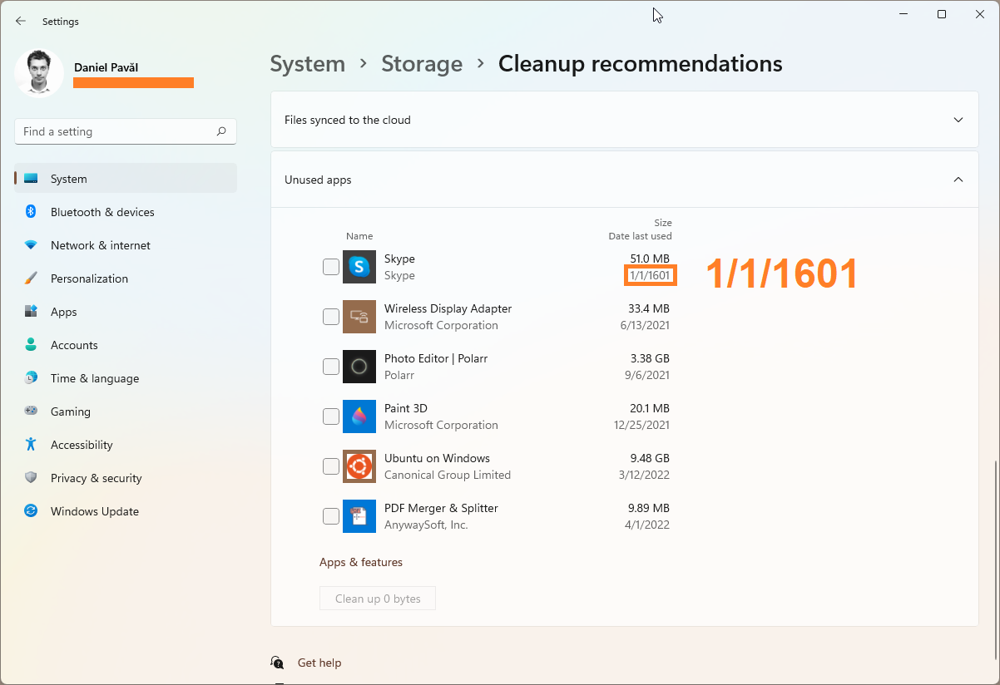

> ℹ️ This is a quick blog post to mainly play with Jekyll.

Not long ago Windows on my laptop reported that Skype was last used on *1/1/1601*.. While I rarely use Skype now-a-days, it surely wasn't that long! January 1st does hint at some kind of a date baseline, just like the Unix epoch, but why *1601*?

Of course, this was a quick answer to look up and it turns out to be that *"1601 was the first year of the 400-year Gregorian calendar cycle at the time Windows NT was made"*[^1]. More specifically, *"The `FILETIME` structure records time in the form of 100-nanosecond intervals since January 1, 1601"*[^2].

While on the subject, it's worth recalling that Unix time records 1-second intervals since January 1, 1970.

Actually, there seem to be [a lot more such Epoch dates](https://en.wikipedia.org/wiki/Epoch_(computing)#Notable_epoch_dates_in_computing), not just the ubiquitous Unix and Windows ones.

[^1]: [Epoch\_(computing)#Notable_epoch_dates_in_computing](https://en.wikipedia.org/wiki/Epoch_(computing)#Notable_epoch_dates_in_computing)
[^2]: [Why is the Win32 epoch January 1, 1601?](https://devblogs.microsoft.com/oldnewthing/20090306-00/?p=18913)