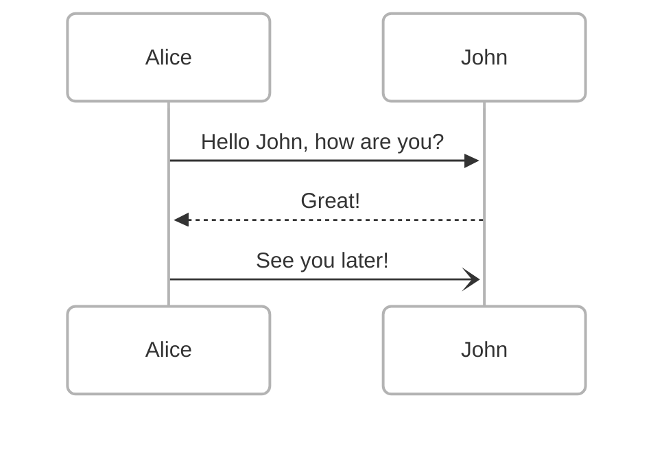

Let's try Hugo's support of mermaid diagrams:



Hugo does not include out-of-the-box support for Mermaid diagrams, but it can be easily customized:

> See https://github.com/danielpaval/danielpaval.github.io/tree/master/layouts external to defined theme

**layouts/_default/_markup/render-codeblock-mermaid.html**
```html
<pre class="mermaid">
    {{ .Inner | htmlEscape | safeHTML }}
</pre>
{{ .Page.Store.Set "hasMermaid" true }}
```

**layouts/_default/baseof.html** before `</body>`
```html
{{ if .Store.Get "hasMermaid" }}
<script type="module">
    import mermaid from 'https://cdn.jsdelivr.net/npm/mermaid/dist/mermaid.esm.min.mjs';
    mermaid.initialize({ startOnLoad: true });
</script>
{{ end }}
```