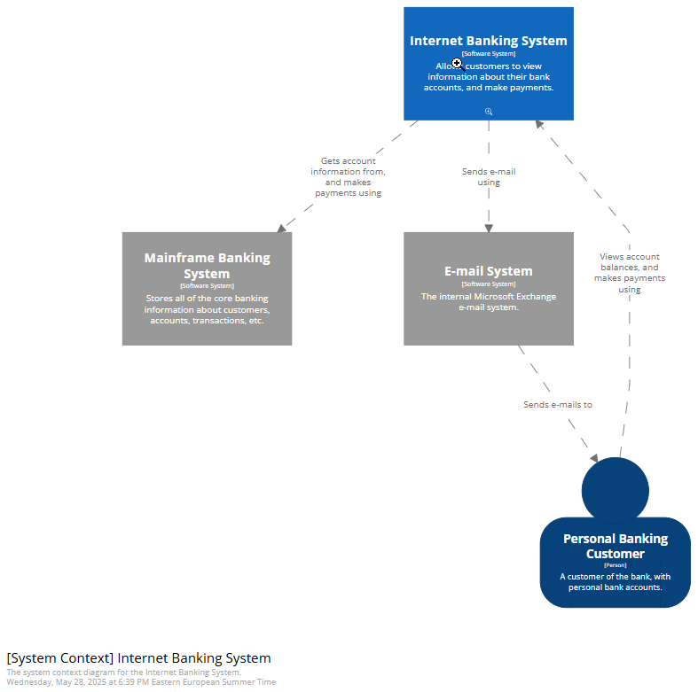

> This WIP post compares Structurizr and LikeC4 with a focus on their export capabilities.

# 2. Export

## 2.1 Export to Static Site

### Structurizr

Prerequisites:
- [Graphviz](https://graphviz.org) dot

Command:

```shell
structurizr export -workspace workspace.dsl -format static
```



Conlusions:
- ⚠️ The static export of Structurizr is a very trimmed version of the Lite version, without the top menu, just the navigation feature starting with the top context diagram

### LikeC4

```shell
likec4 build -o ./dist
```

## 2.2 Export to SVG/PNG

### Structurizr

Structurizr CLI can export to `SVG` or `PNG` format via a Node.js and Puppeteer [workaround](https://github.com/structurizr/puppeteer):

Prerequisites:
- [Node.js](https://nodejs.org)
- Puppeteer

```shell
node export-diagrams.js http://localhost:8080/workspace/diagrams svg
```

### LikeC4

LikeC4 makes use of a similar browser-based workaround, but _only_ supports `PNG`s (⚠️ i.e. no support for `SVG`s):

Prerequisites:
- Playwright

Export all diagrams to PNG:

```shell
likec4 export png -o ./png
```

## 2.3 Export to Mermaid

As Mermaid becomes the factor standard for diagrams-as-code, it is worth looking into converting Structurizr or LikeC4 diagrams in order to align with other Mermaid sources.

### Structurizr

```shell
structurizr export -workspace workspace.dsl -format mermaid
```

Notes
- The Structurizr CLI can export to Mermaid format, but the output rendered by the official Mermaid Chart VS Code extension has some arrows rendered incorrectly and I'm not sure if it the extension or the way the Structurizr CLI is exporting the diagram; however, subsequent Mermaid-to-SVG output seems correct:

```shell
mmdc -i structurizr-SystemContext.mmd -o structurizr-SystemContext.svg
```

### LikeC4

```shell
likec4 gen mmd
likec4 gen mermaid
```

## 2.4 Export to Other Formats

### Structurizr

- Stricturizr CLI can export to D2 format, but the output errors out when parsed by the D2 CLI: `err: failed to compile -: multiboard output cannot be written to stdout`

### LikeC4