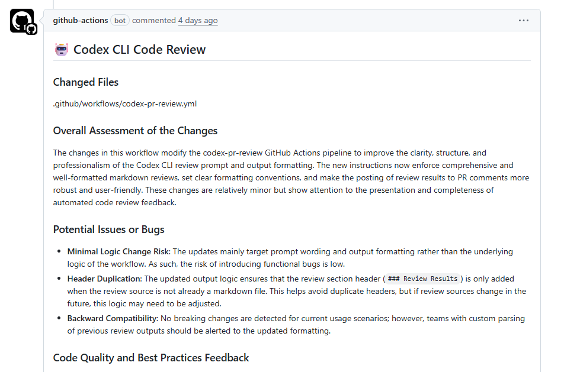

As a followup to [OpenAI Codex CLI in GitHub Actions](/posts/2025-08-08-openai-codex-in-github-actions/) this new workflow automates pull request code reviews:

Check out this [demo repo](https://github.com/danielpaval/ai-workflow-use-cases/blob/main/.github/workflows/codex-pr-review.yml) that uses OpenAI Codex CLI + MCPs in GitHub Actions.

